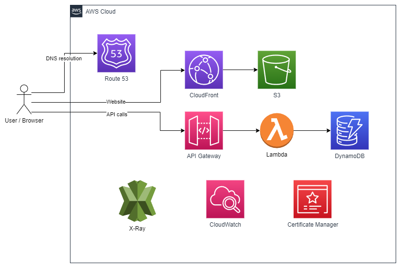

# Fullstack serverless AWS project for thesis

This project establishes two separate serverless AWS infrastructures for production and staging environments. The CI/CD pipeline is implemented through GitHub Actions. Changes in the main branch are deployed to the production environment, while changes to the dev branch are deployed to the staging environment.

## Technologies:

- Frontend with React & TypeScript
- AWS
  - Infrastructure with CDK & TypeScript
  - S3 & CloudFront & Route53 & Certificate Manager for frontend
  - Api Gateway, Lambda, DynamoDB for backend

## Architecture

The project employs a serverless architecture, leveraging AWS services for optimal functionality.

Static files from the React application are stored in Amazon S3 and served through CloudFront, functioning as a Content Delivery Network (CDN). API Gateway serves as the REST API, directing requests to Lambda, which in turn, makes modifications to DynamoDB. Certificate Manager is utilized for the generation of necessary certificates. Route 53 is employed for DNS management. CloudWatch and X-Ray serve logging and debugging purposes, ensuring effective monitoring and troubleshooting capabilities.



## Getting started

The following secrets should be saved to GitHub Secrets in order to run the pipeline successfully the CI/CD pipeline:

- `ACCOUNT_ID`
- `AWS_ACCESS_KEY_ID`
- `AWS_SECRET_ACCESS_KEY`
- `AWS_REGION`

For local cdk deployments create an `.env` file to `/infra` directory. The `.env` file should contain the following:

```
ACCOUNT_ID = <YOUR_AWS_ACCOUNT_ID>
AWS_REGION = <DESIRED-AWS-REGION>
```
