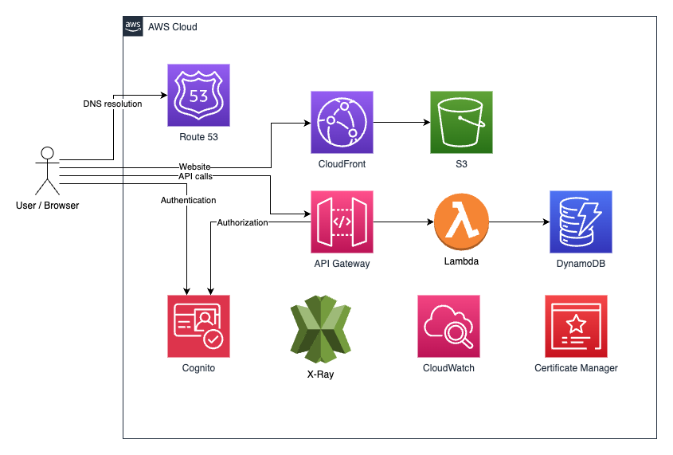

# Fullstack serverless AWS project for thesis

This project sets up distinct serverless AWS infrastructures for both production and staging environments. The continuous integration and continuous deployment (CI/CD) pipeline is orchestrated through GitHub Actions, automating the deployment process based on branch updates.

## Technologies and Services

### Programming Language:

- **TypeScript:**
  - Utilized for writing both React components and AWS CDK infrastructure stack, ensuring a consistent and type-safe development environment.

### Frontend Framework:

- **React:**
  - Employed to craft the dynamic and responsive web application, providing a modern and efficient user experience.

### Infrastructure as Code (IaC):

- **AWS CDK:**
  - Adopted for provisioning and managing the required AWS resources, facilitating the deployment and scaling of the application.

### Cloud Services:

- **Amazon S3 (Simple Storage Service):**

  - Hosted static files for the React application in a serverless fashion, optimizing content delivery.

- **Amazon CloudFront (Content Delivery Network - CDN):**

  - Implemented for the global distribution of the S3-hosted web application, enhancing performance and reducing latency.

- **Amazon API Gateway:**

  - Orchestrated the creation of a serverless CRUD API, forwarding HTTPS requests to the corresponding AWS Lambdas.

- **AWS Lambda:**

  - Executed serverless functions to process incoming requests efficiently and securely.

- **Amazon DynamoDB:**
  - Leveraged as a serverless and scalable database to store and retrieve application data seamlessly.

### Networking and Security:

- **Amazon Route 53:**

  - Utilized as a DNS service to manage domain names and direct traffic efficiently.

- **AWS Certificate Manager (ACM):**
  - Managed SSL/TLS certificates, ensuring secure communication with end-users.

### Monitoring and Debugging:

- **Amazon CloudWatch & AWS X-Ray:**
  - Deployed for logging and debugging purposes, offering insights into application performance and request tracing.

### Code Quality and Maintenance:

- **ESLint & Prettier:**
  - Integrated into the development workflow to enforce coding standards, enhancing code quality and maintainability.

### Continuous Integration/Continuous Deployment (CI/CD):

- **GitHub Actions:**
  - Implemented automated pipelines for both development and main branches, streamlining deployments to production or staging environments.

## Architecture

The project employs a serverless architecture, leveraging AWS services for optimal functionality.

Static files from the React application are stored in Amazon S3 and served through CloudFront, functioning as a Content Delivery Network (CDN). API Gateway serves as the REST API, directing requests to Lambda, which in turn, makes modifications to DynamoDB. Certificate Manager is utilized for the generation of necessary certificates. Route 53 is employed for DNS management. CloudWatch and X-Ray serve logging and debugging purposes, ensuring effective monitoring and troubleshooting capabilities.



## Getting started

The following secrets should be saved to GitHub Secrets in order to run the pipeline successfully the CI/CD pipeline:

- `ACCOUNT_ID`
- `AWS_ACCESS_KEY_ID`
- `AWS_SECRET_ACCESS_KEY`
- `AWS_REGION`

For local cdk deployments create an `.env` file to `/infra` directory. The `.env` file should contain the following:

```
ACCOUNT_ID = <YOUR_AWS_ACCOUNT_ID>
AWS_REGION = <DESIRED-AWS-REGION>
```
